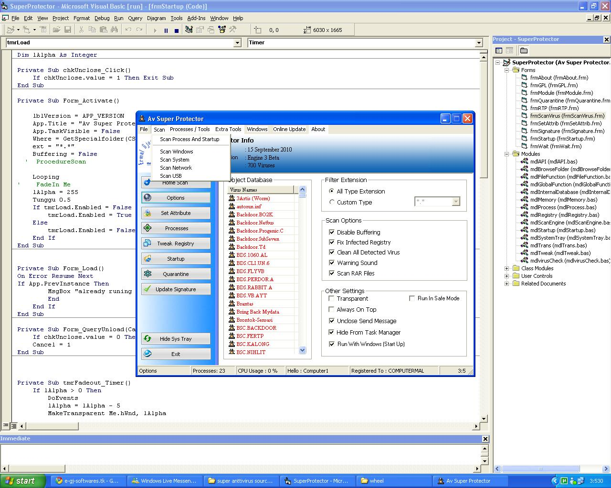



## Super Antivirus 2010

### Description

Super mega pack Antivirus. A collection of some of the best cleaning stuff on the net, for maximum protectionfrom viruses and variants.

Super Antivirus, has a growing large database, 700 viruses.

Scripts for cleaning hiden or system viruses.

bats, fro cleaning the temp and juck files on ur machine

I have been collectin source codes and this is what came out of it.

It is not 100 % Mine..

so what do u think???
 
### More Info
 

             |
---                |---
**Submitted On**   |2010-09-20 18:22:46
**By**             |[Next](https://github.com/Planet-Source-Code/PSCIndex/blob/master/ByAuthor/next.md)
**Level**          |Advanced
**User Rating**    |4.8 (24 globes from 5 users)
**Compatibility**  |VB 4\.0 \(32\-bit\), VB 5\.0, VB 6\.0, VB Script
**Category**       |[Complete Applications](https://github.com/Planet-Source-Code/PSCIndex/blob/master/ByCategory/complete-applications__1-27.md)
**World**          |[Visual Basic](https://github.com/Planet-Source-Code/PSCIndex/blob/master/ByWorld/visual-basic.md)
**Archive File**   |[Super\_Anti2188999232010\.zip](https://github.com/Planet-Source-Code/next-super-antivirus-2010__1-73461/archive/master.zip)

